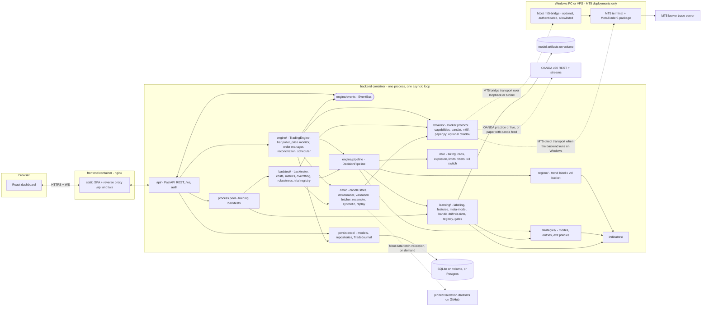
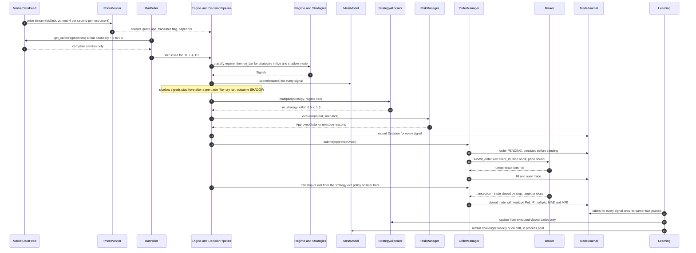
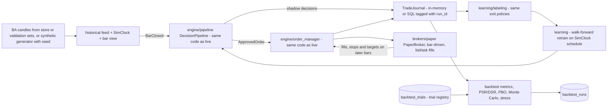

# Altimate FX — Architecture

How the system is put together. `docs/PROJECT_BRIEF.md` wins on conflict; stage scope and
acceptance live in `docs/ROADMAP.md`; decisions are recorded in `docs/adr/`; defaults come from
`docs/research/00-summary.md` §2; security requirements (`SR-n`) from `docs/SECURITY.md`.
Interface sketches below are the contract between agents. Change them here first, then in code.

## 1. Design rules

1. **One decision path.** Regime → strategies → meta-model → allocator → risk is a single pure
   component (`engine/pipeline.py`) used unchanged by the live engine and the backtester. Each
   strategy's exit policy is also shared by the live engine, the backtester and the labeler.
2. **Decision bars come from the broker's historical-bars API** with bid and ask prices
   (OANDA candles `price=BA`; MT5 rates with ask = bid + spread), complete bars only — never
   from aggregated ticks. Live prices are for monitoring, spread and staleness checks and paper
   fills (R02 §5, 00 §3.8).
3. **Broker is the source of truth** for positions, orders and balance; the local DB is a journal
   and a cache that is reconciled against the broker.
4. **Every position has a broker-side stop** attached on fill, so a crashed process leaves
   bounded risk.
5. **Time is injected.** Decision code reads time only from a `Clock`. Backtests use `SimClock`;
   live uses `SystemClock`.
6. **Persist, then publish.** Order/trade state is written to the journal before events go out.
7. **Learning only shrinks or reallocates risk.** The meta-model scales in [0, 1], the allocator in
   [0.5, 1.5], and the risk engine caps the result (≤ 1.0% NAV per trade) — SR-20.
8. **Strategies have modes** (`disabled`, `shadow`, `live`; ADR 0006). Shadow signals are
   recorded and labelled but never become orders.
9. **Every signal is labelled from market data**, executed or not (ADR 0005).
10. **Secrets** live in env as `SecretStr`, are never logged, returned, or sent to the browser.

## 2. Components



| Package | Responsibility | Stage |
|---|---|---|
| `config.py` | `Settings` (pydantic-settings), mode + account-bound interlock validation | 0, 1 |
| `logging.py` | structlog JSON/console logging, secret redaction | 0 |
| `cli.py` | `fxbot` (serve), `fxbot data fetch`, `fxbot data fetch-validation`, `fxbot mt5-bridge`, `fxbot backtest`, `fxbot hash-password`, `fxbot kill-switch` | 0–5 |
| `domain/` | Value types (bid/ask `Candle`), enums, errors, `Clock` | 1 |
| `brokers/` | `Broker` + `MarketDataFeed` + `BrokerCapabilities`, host pinning, OANDA, `PaperBroker`, factory (1); MT5 adapter + optional bridge (1b); cTrader (8, optional) | 1, 1b, 8 |
| `data/` | Candle store with provenance, OANDA downloader, validation fetcher, resampling, synthetic and replay feeds | 1 |
| `indicators/` | Causal vectorized indicators on mid prices | 2 |
| `regime/` | `RegimeClassifier` → `RegimeState(trend, vol)` with hysteresis | 2 |
| `strategies/` | `Strategy`, `StrategyMode`, `trend_breakout_h4`, `mean_reversion_h1`, `session_breakout_h1`, registry | 2 |
| `backtest/` | `Backtester`, costs, metrics, PSR/DSR/PBO, robustness, trial registry, walk-forward, reports | 2 |
| `risk/` | Sizing, stops, portfolio caps, exposure, limits and ladder, filters, news calendar, kill switch, fat-finger checks, `RiskManager` | 2 (stub), 3 |
| `learning/` | Features, labeling, weights, purged CV, meta-model, trainer, bandit, drift, registry, promotion gates, `LearningScheduler` | 4 |
| `engine/` | `DecisionPipeline`, `OrderManager` (2, hardened 5); `TradingEngine`, bar poller, price monitor, reconciliation, events, scheduler, instance lock (5) | 2, 5 |
| `persistence/` | SQLAlchemy models, repositories, `TradeJournal` (in-memory 2, SQL 5), Alembic from 5 | 1–5 |
| `api/` | FastAPI app, routers, WebSocket, auth and browser protections | 5 |

## 3. Data flow

### 3.1 Live / practice / paper trading loop



Steps in words:

1. **Price monitor.** OANDA: one pricing stream for all instruments (at most 4 prices/s per
   instrument, last-in-window only). MT5: polling of the latest tick (no push stream). It feeds
   spread and quote-age filters, `tradeable` checks, cost-drift monitoring, the UI, and
   `PaperBroker` fills in paper mode. It never builds bars.
2. **Bar poller.** At each H1/H4/D1 boundary (H4 and D1 aligned to 17:00 New York) + 2–5 s it
   fetches the just-closed bars — OANDA candles with `price=BA`, `smooth=false`,
   `includeFirst=false`, `complete=true` only; MT5 rates converted from server time to UTC, ask
   derived from bid + spread, forming bar dropped, H4/D1 resampled from H1 when the server day
   is not NY-close aligned — retrying until complete or timing out (then backfilling). The
   backtester uses the same stored bars, which keeps parity.
3. **Pipeline** (sync, pure, seeded RNG) runs per instrument on each closed bar:
   regime `(trend, vol)` with 2-bar hysteresis → strategies whose mode is `live` or `shadow` and
   whose gate allows the regime → features → meta-model score → for live-mode signals:
   allocator multiplier → `OrderIntent` → risk decision; for shadow-mode signals: a
   pre-trade-filter dry run sets the `executable` flag and the decision ends as `SHADOW`.
4. **Entry gate.** The engine holds a set of pause reasons (kill switch, loss limits, drawdown
   halt, stale feed, health breakers, reconciliation discrepancy, `live_startup`). Entries are
   allowed only when the set is empty; exits are always allowed.
5. **Order manager** persists the order, applies SR-15 fat-finger and SR-16 rate checks,
   submits with a deterministic `afx-` client ID, and records the fill. Exits come from
   broker-side stops, the strategy exit policy (chandelier trail via stop modification, exit
   signal, time stop), manual close or the kill switch.
6. **Learning.** A labeling sweep simulates each signal's exit policy on BA bars once its
   barrier has passed and stores the label. The allocator updates from executed closed trades
   only; drift monitors update online; the meta-model is retrained in batch and promoted only
   through gates (ADR 0005).

### 3.2 Backtest flow



- Same strategies, regime classifier, `RiskManager`, meta-model, allocator, labeler and
  `OrderManager` as live; only the clock, the bar source, the broker price source and the
  journal backend differ. Strategy modes come from the run config (default: current settings;
  a shadow strategy can be evaluated "as live" for gate evaluation).
- Fills (R06 §2, §8): signal on the close of bar `t` fills at the open of `t+1` (plus optional
  latency) on the correct side; long stop/TP on bid, short on ask; gaps fill at the open; stop
  wins on ambiguous bars and ambiguous bars are counted.
- Costs: spread from BA candles (fallback hour-of-week table), slippage, financing at 17:00 NY
  from instrument rates and `daysCharged`, commission; each reported separately; stress
  multipliers.
- Statistics: PSR/DSR using the trial registry count, CSCV/PBO, trade-reshuffle Monte Carlo,
  block bootstrap, random-entry benchmark, cost/delay stress, parameter perturbation,
  per-year/per-pair split. The accepted reference run per strategy supplies the expected R
  distribution and drawdown bands shown next to live results.
- Reproducibility: data hash, config hash, code commit, seeds, trial count. Same inputs → same
  report bytes.
- Parity: `tests/engine/test_parity.py` replays identical bars through `TradingEngine` and
  `Backtester` and requires identical decisions and trades.

## 4. Key interfaces

Sketches, not final code. Money/prices are `Decimal`; indicator and learning internals use
`float64`. All datetimes are tz-aware UTC.

```python
from __future__ import annotations

from collections.abc import AsyncIterator, Mapping, Sequence
from dataclasses import dataclass
from datetime import datetime
from decimal import Decimal
from enum import StrEnum
from typing import Literal, Protocol

import pandas as pd


# ---- domain/ ---------------------------------------------------------------
class Mode(StrEnum):              # trading mode of the process
    PAPER = "paper"
    PRACTICE = "practice"
    LIVE = "live"


class Side(StrEnum):
    BUY = "buy"
    SELL = "sell"


@dataclass(frozen=True, slots=True)
class OHLC:
    o: Decimal
    h: Decimal
    l: Decimal
    c: Decimal


@dataclass(frozen=True, slots=True)
class Candle:
    instrument: str               # "EUR_USD"
    granularity: Granularity      # H1, H4, D (H4/D aligned to 17:00 New York)
    time: datetime                # bar open time; usable only after time + granularity
    bid: OHLC
    ask: OHLC
    volume: int
    complete: bool                # only complete candles are stored or used
    @property
    def mid(self) -> OHLC: ...    # derived; indicators use mid


@dataclass(frozen=True, slots=True)
class OrderRequest:
    client_id: str                # "afx-..." -> OANDA clientExtensions.id; MT5 magic + comment token
    instrument: str
    side: Side
    units: Decimal                # > 0, rounded down to units_step; adapter applies the sign
    stop_loss: Decimal            # mandatory, attached on fill
    take_profit: Decimal | None
    price_bound: Decimal | None   # worst acceptable fill price (0.1 ATR for S1)
    strategy_id: str
    signal_id: str

# Also: Instrument (pip_location, display_precision, units_precision, min_units, margin_rate,
# financing), Price(bid, ask, time, tradeable), OrderResult(status FILLED|CANCELLED|REJECTED|
# UNKNOWN, client_id, broker_order_id, fill, reject_reason), Fill, Trade, Position,
# AccountSummary(nav, balance, margin_used, margin_closeout_percent), Transaction, TransactionPage.


class Clock(Protocol):
    def now(self) -> datetime: ...


# ---- brokers/base.py -------------------------------------------------------
@dataclass(frozen=True, slots=True)
class BrokerCapabilities:
    supports_sl_on_fill: bool
    supports_trailing_stop: bool
    supports_hedging: bool
    fifo_required: bool           # e.g. US/NFA accounts -> risk allows 1 trade per instrument
    position_accounting: Literal["per_trade", "netting"]  # MT5 netting -> 1 per instrument
    units_step: Decimal           # OANDA 1; MT5/cTrader often 0.01 lot = 1000 units
    min_units: Decimal
    max_units: Decimal | None
    max_orders_per_second: float
    candle_price_sides: frozenset[Literal["B", "A", "M"]]


class MarketDataFeed(Protocol):
    async def get_candles(
        self, instrument: str, granularity: Granularity,
        start: datetime, end: datetime | None = None, *, price: Literal["BA"] = "BA",
    ) -> list[Candle]: ...        # complete candles only, ascending

    def stream_prices(self, instruments: Sequence[str]) -> AsyncIterator[Price]: ...
    # monitoring only; raises FeedStaleError when no tick/heartbeat arrives within stale_after


class Broker(Protocol):
    name: str
    capabilities: BrokerCapabilities
    async def get_account(self) -> AccountSummary: ...
    async def get_instruments(self, names: Sequence[str] | None = None) -> list[Instrument]: ...
    async def get_open_trades(self) -> list[Trade]: ...
    async def get_positions(self) -> list[Position]: ...
    async def submit_order(self, order: OrderRequest) -> OrderResult: ...  # never auto-retried
    async def find_order(self, client_id: str) -> OrderResult | None: ...  # via transactions
    async def modify_trade_exits(
        self, broker_trade_id: str, *,
        stop_loss: Decimal | None = None, take_profit: Decimal | None = None,
    ) -> None: ...
    async def close_trade(self, broker_trade_id: str, units: Decimal | None = None) -> Fill: ...
    async def close_all(self) -> list[Fill]: ...
    async def get_transactions_since(self, last_id: str | None) -> TransactionPage: ...


# ---- regime/ ---------------------------------------------------------------
class TrendLabel(StrEnum):
    TREND = "trend"               # ADX(14) >= 25 and ER(20) >= 0.30
    RANGE = "range"               # ADX(14) < 20 and ER(20) < 0.20
    NEUTRAL = "neutral"
    UNDEFINED = "undefined"       # warm-up (incl. < 120 days of ATR history)


class VolBucket(StrEnum):         # ATR(14)/close percentile over 120 days
    LOW = "low"                   # < 0.25
    NORMAL = "normal"             # 0.25-0.75
    HIGH = "high"                 # 0.75-0.95
    EXTREME = "extreme"           # >= 0.95 -> no new entries


@dataclass(frozen=True, slots=True)
class RegimeState:
    trend: TrendLabel
    vol: VolBucket | None         # None while undefined
    inputs: Mapping[str, float]   # adx, er, atr_pct, raw (pre-hysteresis) labels
    @property
    def cell(self) -> tuple[TrendLabel, VolBucket | None]: ...  # allocator / stats key
    @property
    def allows_entries(self) -> bool: ...  # False if UNDEFINED or EXTREME


class RegimeClassifier(Protocol):
    version: str
    def classify(self, bars: BarView, previous: RegimeState | None) -> RegimeState: ...
    # a label switches only after holding for 2 consecutive complete bars


# ---- strategies/ -----------------------------------------------------------
class StrategyMode(StrEnum):      # ADR 0006; independent of the trading Mode
    DISABLED = "disabled"
    SHADOW = "shadow"             # signals + features + labels, never orders
    LIVE = "live"                 # places orders in the current trading mode


@dataclass(frozen=True, slots=True)
class BarContext:
    instrument: Instrument
    bars: Mapping[Granularity, BarView]  # H1/H4/D views, complete bars only, no access past t
    regime: Mapping[Granularity, RegimeState]
    quote: Price | None           # latest monitored quote (spread checks), never for signals
    now: datetime                 # from Clock


@dataclass(frozen=True, slots=True)
class Signal:
    id: str                       # deterministic hash(strategy_id, instrument, bar_time)
    strategy_id: str
    strategy_version: str
    instrument: str
    side: Side
    bar_time: datetime            # close time of the signal bar
    entry_ref: Decimal            # mid close of the signal bar
    stop_distance: Decimal        # e.g. 2.5 x ATR(20) for S1
    take_profit_distance: Decimal | None
    price_bound_distance: Decimal | None
    rationale: str


class TradeAction:                # MoveStop(price) | Exit(reason)
    ...


class Strategy(Protocol):
    id: str                       # "trend_breakout_h4"
    version: str                  # bump on any logic or parameter change
    timeframe: Granularity        # decision timeframe
    uses: frozenset[Granularity]  # e.g. {H4, D} for S1
    warmup_bars: int
    def allowed(self, regime: RegimeState) -> bool: ...          # gating table R03 §5.5
    def on_bar(self, ctx: BarContext) -> Signal | None: ...      # pure
    def manage(self, ctx: BarContext, trade: Trade) -> TradeAction | None: ...
    # exit policy (trail, exit signal, time stop): used live, in backtests and by the labeler


# ---- learning/ -------------------------------------------------------------
@dataclass(frozen=True, slots=True)
class Label:
    signal_id: str
    r_net: float                  # after spread, slippage, financing
    y: int                        # 1 if r_net > 0
    exit_reason: str              # stop | tp | trail | time | signal
    bars_held: int
    mae_r: float
    mfe_r: float
    t_end: datetime               # label window end, for purging
    ambiguous_bar: bool


class Labeler(Protocol):
    def label(self, signal: Signal, strategy: Strategy, bars: BarView) -> Label | None: ...
    # None until the barrier has passed; simulates Strategy.manage with PaperBroker fill rules


class FeatureBuilder(Protocol):
    schema_version: str
    def build(self, signal: Signal, ctx: BarContext) -> Mapping[str, float]: ...
    # causal; no own-P&L, drawdown or account-size features


class MetaModel(Protocol):
    version: str                  # "passthrough" until >= 300 labelled events
    feature_schema_version: str
    def score(self, features: Mapping[str, float]) -> float: ...       # calibrated p_hat
    def size_multiplier(self, p_hat: float, p_star: float) -> float: ...
    # clip((p_hat - p_star) / 0.15, 0, 1); < 0.2 means skip; never > 1


class StrategyAllocator(Protocol):  # discounted NIG Thompson sampling with a cash arm
    def multiplier(self, strategy_id: str, cell: tuple[TrendLabel, VolBucket | None]) -> float: ...
    # clip(N_active x P_best, 0.5, 1.5); 1.0 below 20 effective observations
    def update(self, strategy_id: str, cell: tuple[TrendLabel, VolBucket | None],
               r_net: float, at: datetime) -> None: ...  # executed closed trades only
    def p_positive(self, strategy_id: str) -> float: ...  # demotion if < 0.10 after >= 50 trades
    def state(self) -> AllocatorState: ...


# ---- risk/ -----------------------------------------------------------------
@dataclass(frozen=True, slots=True)
class OrderIntent:
    signal: Signal
    regime: RegimeState
    m_meta: float                 # [0, 1]
    m_strategy: float             # [0.5, 1.5]


class ApprovedOrder:
    """Wraps an OrderRequest. Constructible only inside risk/ (SR-13)."""
    request: OrderRequest
    risk_amount: Decimal          # all-in 1R in account currency


@dataclass(frozen=True, slots=True)
class RiskDecision:
    approved: ApprovedOrder | None
    reasons: tuple[RiskReason, ...]  # code + message; adjustments or rejections


class KillSwitch(Protocol):
    @property
    def engaged(self) -> bool: ...
    async def engage(self, reason: str, actor: str) -> None: ...   # persisted, audited
    async def release(self, reason: str, actor: str) -> None: ...  # typed confirmation upstream


class RiskManager(Protocol):
    kill_switch: KillSwitch
    def evaluate(self, intent: OrderIntent, snapshot: RiskSnapshot) -> RiskDecision: ...  # pure
    def pre_trade_filters(self, signal: Signal, snapshot: RiskSnapshot) -> tuple[RiskReason, ...]: ...
    # shadow dry run: filters only, no sizing, never an ApprovedOrder
    def on_equity(self, nav: Decimal, at: datetime) -> list[RiskEvent]: ...  # limits, ladder
    def on_trade_closed(self, trade: ClosedTrade) -> list[RiskEvent]: ...
# RiskSnapshot: account, open trades, exposure, clusters, day/week start NAV, peak NAV, ladder
# step, live phase, quotes and spread medians, calendar windows, pause reasons, capabilities, now.


# ---- engine/ ---------------------------------------------------------------
class DecisionPipeline:          # concrete, shared by TradingEngine and Backtester
    def __init__(self, *, regime: RegimeClassifier, strategies: Sequence[Strategy],
                 modes: Mapping[str, StrategyMode], features: FeatureBuilder,
                 meta_model: MetaModel, allocator: StrategyAllocator, risk: RiskManager,
                 seed: int) -> None: ...
    def on_bar_close(self, instrument: Instrument, ctx: BarContext,
                     snapshot: RiskSnapshot) -> list[Decision]: ...


class OrderManager(Protocol):
    async def submit(self, order: ApprovedOrder) -> OrderRecord: ...  # idempotent, SR-15/16
    async def apply(self, trade_id: str, action: TradeAction) -> None: ...  # trail or exit
    async def close(self, trade_id: str, reason: ExitReason) -> None: ...
    async def flatten_all(self, reason: ExitReason) -> None: ...      # retries until flat
    async def resolve_unknown(self) -> None: ...


class TradeJournal(Protocol):
    async def record_decision(self, decision: Decision) -> None: ...
    async def record_label(self, label: Label) -> None: ...
    async def record_order(self, order: OrderRecord) -> None: ...
    async def record_fill(self, fill: Fill) -> None: ...
    async def record_trade_closed(self, trade: ClosedTrade) -> None: ...
    async def record_equity(self, snapshot: EquitySnapshot) -> None: ...
    async def record_risk_event(self, event: RiskEvent) -> None: ...
    async def closed_trades(self, *, since: datetime | None = None,
                            strategy_id: str | None = None,
                            mode: Mode | None = None) -> list[ClosedTrade]: ...
    async def unlabeled_signals(self, *, before: datetime) -> list[Signal]: ...


class TrialRegistry(Protocol):    # backtest/trials.py
    def record(self, family: str, config_hash: str, run_id: str) -> None: ...
    def count(self, family: str) -> int: ...  # N used by DSR and strategy gates


class Engine(Protocol):
    mode: Mode
    async def start(self) -> None: ...   # interlock -> lock -> load state -> reconcile -> run
    async def stop(self) -> None: ...    # no flatten; positions keep broker-side stops
    async def pause_entries(self, reason: str, actor: str) -> None: ...
    async def resume_entries(self, reason: str, actor: str) -> None: ...
    def status(self) -> EngineStatus: ...  # mode, feed health, pauses, ladder, last reconcile
```

`Decision` = signal + strategy mode + `RegimeState` + features + meta score and model version +
allocator multiplier + outcome (`ACCEPTED | SHADOW | FILTERED_META | REJECTED_RISK |
ENTRIES_PAUSED`) + `executable` flag + `RiskDecision`. It is the audit record behind every row in
`signals`.

## 5. Event model

In-process `EventBus` (`engine/events.py`). Events are frozen Pydantic models:
`{type, seq, ts, mode, data}` where `seq` is monotonic per process and `ts` comes from the
`Clock` (sim time in backtests). Each subscriber gets a bounded `asyncio.Queue`; the trading path
never awaits UI subscribers. A slow WebSocket client drops events (counted) and is sent a
`resync` hint to refetch via REST.

| Event | Producer | Persisted in | WS channel |
|---|---|---|---|
| `PriceTick` | price monitor | — | `prices` (throttled ≤ 4/s per instrument) |
| `BarClosed` | bar poller (candles endpoint) | `candles` | `prices` |
| `SignalDecided` | engine (pipeline) | `signals` | `signals` |
| `SignalLabeled` | labeling sweep | `labels` | `signals` |
| `RegimeChanged` | engine | `signals` regime columns | `strategies` |
| `OrderSubmitted` / `OrderFilled` / `OrderRejected` / `OrderUnknown` | order manager | `orders` | `orders` |
| `TradeOpened` / `TradeUpdated` / `TradeClosed` | order manager | `trades` | `trades`, `positions` |
| `EquityUpdated` | engine equity task | `equity_snapshots` (periodic) | `account` |
| `RiskEvent` (limit breach, ladder step, filter window, settings change) | risk manager, API | `risk_events` | `risk` |
| `KillSwitchChanged` / `EntriesPauseChanged` | risk, engine | `settings`, `risk_events` | `risk`, `status` |
| `ReconciliationCompleted` / `ReconciliationDiscrepancy` | reconciler | `risk_events` | `status`, `risk` |
| `StrategyModeChanged` | API (operator) or allocator demotion | `settings`, `risk_events` | `strategies` |
| `GateEvaluated` | promotion (meta and strategy gates) | `strategy_evaluations`, `model_versions` | `learning`, `strategies` |
| `AllocationUpdated` | learning | `bandit_state` | `learning` |
| `DriftAlert` (P&L, model, features, costs, labels) | learning/drift | `risk_events` | `learning` |
| `ModelRegistered` / `ModelPromoted` / `ModelRolledBack` | registry, promotion | `model_versions`, `risk_events` | `learning` |
| `BacktestProgress` / `BacktestCompleted` | backtest worker | `backtest_runs`, `backtest_trials` | `backtests` |
| `EngineStatusChanged` / `FeedHealthChanged` | engine | — | `status` |

Per-signal risk rejections live on the `signals` row, not in `risk_events`, to keep the event log
about state changes.

## 6. Concurrency model

- **One process, one asyncio loop, one uvicorn worker.** The engine starts in the FastAPI
  lifespan. More workers would mean more engines, so `--workers 1` is mandatory and an instance
  lock (`engine/lock.py`: OS file lock in `FXBOT_DATA_DIR` for SQLite, `pg_advisory_lock` for
  Postgres) stops a second process trading the same account.

| Task | Does |
|---|---|
| `prices` | OANDA pricing stream or MT5 tick polling → price monitor (spread, quote age, `tradeable`), cost monitor, `PaperBroker` fills in paper mode |
| `bars` | Bar poller: at each H1/H4/D1 boundary + 2–5 s fetch complete BA candles → bounded `bar_queue` |
| `decision` | Consumes `bar_queue` in order → strategy exit policies for open trades → pipeline → order manager. Bars older than one period are journaled and skipped |
| `transactions` | OANDA transaction stream (or `sinceid` polling) / MT5 deal-history polling / paper transaction log → fills, stop and target closes |
| `reconcile` | On start, every 60 s, and after any `UNKNOWN` order |
| `equity` | NAV snapshot every 60 s and on every fill → loss limits, drawdown ladder, margin guard |
| `scheduler` | 17:00 NY rollover (limits reset, clusters, D1 close), Friday cut-off, calendar windows, labeling sweep, weekly PSI, retrain Sunday 18:00 NY, gate evaluations |
| `ws` | One sender per client, fed from its bus queue |

- **Trading lock.** One `asyncio.Lock` serializes order submission, stop modifications,
  flatten-all and reconciliation mutations, so reconciliation never races an in-flight order.
- **MT5 calls** (direct transport) run on one dedicated worker thread; the `MetaTrader5`
  package is blocking and not thread-safe. The bridge server uses the same single-thread rule.
- **CPU-bound work** (model training, labeling of large backlogs, backtests, robustness runs)
  runs in a `ProcessPoolExecutor` (1–2 workers, one job per kind, SR-37). Single-row scoring,
  bandit sampling and small indicator windows run inline. Nothing blocking runs on the loop:
  DB via async SQLAlchemy (aiosqlite), HTTP via httpx with explicit timeouts on every call.
- **Shutdown.** Pause entries → cancel tasks → flush journal → release lock. Positions are not
  flattened; their broker-side stops stay active.

## 7. Persistence

SQLAlchemy 2 async; SQLite by default (`FXBOT_DATABASE_URL`, WAL, `busy_timeout`), Postgres-ready.
`create_all` until stage 5, Alembic migrations from stage 5. Money columns `Numeric`, times UTC.
`mode` is stored on journal rows so paper, practice and live histories never mix. The DB never
stores secrets (SR-45).

| Table | Key columns | Notes |
|---|---|---|
| `instruments` | `name` PK, base, quote, pip_location, display_precision, units_precision, min_units, margin_rate, financing JSON, enabled | Refreshed from broker on start |
| `datasets` | `id` PK; source, price_side (BA/B/M), smoothed, tz_origin, sha256, licence_note, fetched_at | Provenance for every candle (R07 §4) |
| `candles` | PK (instrument, granularity, time); bid o/h/l/c, ask o/h/l/c, volume, dataset_id | Complete candles only; mid derived |
| `signals` | `id` PK; bar_time, instrument, granularity, strategy_id, strategy_version, strategy_mode, trend, vol, regime_inputs JSON, features JSON, feature_schema_version, meta_score, meta_model_version, m_strategy, outcome, executable, reasons JSON, mode, run_id | One row per `Decision` |
| `labels` | `signal_id` PK/FK; r_net, y, exit_reason, bars_held, mae_r, mfe_r, t_end, cost_r, ambiguous_bar, labeler_version | Every signal, executed or not |
| `orders` | `id` PK; `client_id` UNIQUE, signal_id FK, broker_order_id, instrument, side, units, stop_loss, take_profit, price_bound, status, reject_reason, submitted_at, updated_at, mode | pending → submitted → filled / rejected / cancelled / unknown |
| `trades` | `id` PK; `broker_trade_id` UNIQUE, order_id FK, signal_id FK, strategy_id, instrument, side, units, entry_time, entry_price, initial_stop, current_stop, take_profit, exit_time, exit_price, exit_reason, realized_pl, financing, commission, half_spread_cost, r_multiple, mae_r, mfe_r, trend_at_entry, vol_at_entry, origin, status, mode | `origin`: system / adopted / external |
| `equity_snapshots` | `id` PK; time, balance, nav, unrealized_pl, margin_used, margin_closeout_percent, open_trades, peak_nav, drawdown, ladder_step, mode | |
| `model_versions` | `id` PK; kind, version, status (challenger / champion / retired / rejected), artifact_path, artifact_sha256, feature_schema_version, data_hash, code_commit, seed, train_start, train_end, n_samples, n_configs_tried, params JSON, metrics JSON, gates JSON, parent_version, created_at, promoted_at | Reproducibility tuple (R05 §8.2) |
| `model_scores` | PK (signal_id, model_version); p_hat, m_meta | Champion and shadow challenger scores on the same signals |
| `bandit_state` | PK (strategy_id, trend, vol); n, sum_x, sum_x2, updated_at | Discounted sufficient statistics; `trend/vol = '*'` for the global level |
| `strategy_evaluations` | `id` PK; strategy_id, evaluated_at, window, n_trades, metrics JSON, gates JSON, passed, approved_by, approved_at | Shadow → live gate reports and approvals |
| `risk_events` | `id` PK; time, type, severity, actor (system / operator), instrument, signal_id, order_id, details JSON | Audit log (SR-21) |
| `settings` | `key` PK; value JSON, updated_at, updated_by | Runtime non-secret keys only: risk params, instruments, strategy modes, kill-switch and pause state, calendar |
| `backtest_runs` | `id` PK; created_at, status, params JSON, data_source, data_hash, seed, code_version, config_hash, family, metrics JSON, stats JSON (PSR, DSR, PBO, MC bands, stress), equity_curve JSON, trades path, error, is_reference | Reference run per strategy feeds expectations |
| `backtest_trials` | `id` PK; family, config_hash, run_id, created_at | Trial registry for DSR and gates |
| `sessions` (optional) | `id_hash` PK; created_at, last_seen, expires_at | Only if sessions survive restarts (SR-27) |

Allocator state is persisted after every update; it can be rebuilt from executed closed trades.
Model artifacts live in `FXBOT_DATA_DIR/models/` and are loaded only if their SHA-256 matches
`model_versions` (SR-43). Validation datasets live in git-ignored `data/validation/`.

## 8. API surface

REST under `/api`, JSON, Decimals as strings, timestamps ISO 8601 UTC, cursor pagination
(`limit` ≤ 500). Auth per SR-25 – SR-33: argon2id operator password, opaque session ID in an
`HttpOnly; SameSite=Strict` cookie, Origin check on state-changing requests, trusted hosts,
WebSocket authenticated before accept. Every route except `/api/health` and
`/api/auth/login` requires a session. No response model contains a secret field. State changes
are `POST`/`PATCH` with a `reason` and are audited.

| Method & path | Purpose |
|---|---|
| `GET /api/health` | Liveness: status, version, mode (no auth, nothing sensitive) |
| `POST /api/auth/login`, `POST /api/auth/logout`, `GET /api/auth/me` | Session |
| `GET /api/status` | Mode, engine/feed/broker health, pause reasons, kill switch, ladder step, live phase, last reconciliation |
| `GET /api/account` | Balance, NAV, margin, unrealized P&L |
| `GET /api/equity?from&to&resolution` | Equity curve with drawdown |
| `GET /api/positions` | Open trades with current stop |
| `POST /api/positions/{trade_id}/close` | Manual close (allowed while kill switch engaged) |
| `GET /api/trades?instrument&strategy&side&outcome&exit_reason&trend&vol&from&to&cursor&limit` | Trade history |
| `GET /api/trades/{id}` | Trade detail: signal, decision, orders, fills, stop history, label vs realized R |
| `GET /api/signals?strategy&mode&outcome&executable&...` | Decisions incl. shadow, filtered, rejected, with labels |
| `GET /api/candles?instrument&granularity&from&to` | Chart data (mid derived) |
| `GET /api/instruments` | Instrument list and enabled flags |
| `GET /api/strategies` | Per strategy: mode, performance overall and by regime cell, live vs shadow |
| `POST /api/strategies/{id}/mode` `{mode, reason, confirm}` | Demote any time; promote to `live` only if the latest gate evaluation passed (manual approval) |
| `GET /api/strategies/{id}/gates` | Latest shadow → live gate report |
| `GET /api/expectations?strategy&instrument` | Reference backtest R distribution and Monte-Carlo drawdown bands vs realized R and current drawdown percentile |
| `GET /api/regimes` | Current (trend, vol) per instrument and timeframe + history |
| `GET /api/allocator` | Multipliers and posteriors per strategy × cell + history |
| `GET /api/learning/models?kind` / `GET /api/learning/models/{version}` | Versions, metrics, gate results |
| `POST /api/learning/models/{version}/promote`, `POST /api/learning/rollback`, `POST /api/learning/retrain` | Gated operator actions |
| `GET /api/learning/drift` | Drift monitors and alerts |
| `GET /api/risk` | Limits vs usage, ladder, live phase, pauses, kill switch, active filter windows |
| `GET /api/risk/events?type&from&to&cursor` | Audit log |
| `POST /api/risk/kill-switch` `{action: engage \| release, reason}` | Kill switch (release needs typed confirmation in the UI) |
| `POST /api/engine/entries` `{action: pause \| resume, reason}` | Pause/resume entries (also clears `live_startup` and the −12% halt) |
| `GET /api/backtests`, `POST /api/backtests` (202 + id), `GET /api/backtests/{id}` | Backtests (bounded, one at a time, SR-37) |
| `GET /api/settings`, `PATCH /api/settings` `{changes, reason, confirm}` | Non-secret runtime settings; loosening needs `confirm`; trading mode read-only; secrets reported only as configured / not configured |
| `GET /api/calendar`, `PUT /api/calendar` (CSV/JSON body) | News events for the blackout filter |

**WebSocket** `/ws`. Session cookie and Origin checked before accept; failure → close 1008.
Client → server: `{"op": "subscribe" | "unsubscribe", "channels": [...]}`, `{"op": "ping"}`
(validated, ≤ 4 KiB). Server → client envelope: `{"channel", "type", "seq", "ts", "data"}`.
Channels: `status`, `prices`, `account`, `positions`, `orders`, `trades`, `signals`, `risk`,
`strategies`, `learning`, `backtests`. On subscribe the server sends a snapshot, then deltas.

## 9. Configuration, modes and the live-trading interlock

Settings come from env (and `.env` in development) via pydantic-settings in `fxbot/config.py`,
which is canonical. Every variable uses the `FXBOT_` prefix except `ALLOW_LIVE_TRADING`. The
`Settings` object is frozen; strategy, risk and learning parameters have code defaults from
`docs/research/00-summary.md` §2 and are overridden at runtime from the `settings` table within
hard caps defined in code (SR-15, SR-35).

| Setting | Default | Notes |
|---|---|---|
| `FXBOT_TRADING_MODE` | `paper` | `paper` / `practice` / `live`; read at start-up only (SR-9) |
| `ALLOW_LIVE_TRADING` | `false` | No prefix on purpose; env only |
| `FXBOT_BROKER` | `oanda` | `oanda` / `mt5` (stage 1b) / `ctrader` (stage 8, optional); ignored in `paper` |
| `FXBOT_LIVE_CONFIRM_ACCOUNT_ID` | unset | Must equal the live account: OANDA account ID or MT5 login (SR-10) |
| `FXBOT_LIVE_TRADING_CONFIRMED` | `false` | Scaffold boolean; not sufficient on its own (SR-10) |
| `FXBOT_OANDA_ACCOUNT_ID` / `FXBOT_OANDA_API_TOKEN` | unset | `SecretStr`; masked in API and logs |
| MT5 settings *(stage 1b; names final in `config.py`)* | unset | login, password (`SecretStr`, optional if the terminal is logged in), server name, terminal path, magic number, symbol map, transport `direct` / `bridge`, bridge address (loopback or tunnel only) and bridge secret (`SecretStr`) |
| `FXBOT_DATA_FEED` | `synthetic` | Paper only: `synthetic` / `replay` / `oanda` |
| `FXBOT_DATA_DIR` | `./data` (`/app/data` in the image) | Model artifacts, lock file, `validation/` |
| `FXBOT_DATABASE_URL` | `sqlite+aiosqlite:///./data/fxbot.db` (`/app/data/fxbot.db` in the image) | Postgres needs an async driver; URL with password must be `SecretStr` |
| `FXBOT_API_HOST` / `FXBOT_API_PORT` | `127.0.0.1` / `8000` | Image sets `0.0.0.0` |
| `FXBOT_DASHBOARD_PASSWORD_HASH` | unset | argon2id; required in every mode (SR-26) |
| `FXBOT_ALLOWED_HOSTS` / `FXBOT_ALLOWED_ORIGINS` | localhost, 127.0.0.1 / `:8080` and `:5173` origins | SR-29, SR-31 |
| `FXBOT_MAX_ORDER_UNITS` | 100 000 paper/practice; required in `live` | SR-15 |
| `FXBOT_LOG_LEVEL` / `FXBOT_LOG_JSON` | `INFO` / `false` | Image sets JSON |

| Mode | Broker | Decision bars / monitor | Requires |
|---|---|---|---|
| `paper` | `PaperBroker` | per `FXBOT_DATA_FEED` (synthetic BA candles + ticks; replay; or OANDA candles + stream read-only) | nothing beyond the dashboard password |
| `practice` | `OandaBroker` on the fxpractice host, **or** `Mt5Broker` on an MT5 **demo** account | broker bars / broker prices | broker credentials; MT5 account trade mode must be demo |
| `live` | `OandaBroker` on the fxtrade host, **or** `Mt5Broker` on an MT5 **real** account | broker bars / broker prices | credentials + `ALLOW_LIVE_TRADING=true` + `FXBOT_LIVE_CONFIRM_ACCOUNT_ID` == OANDA account ID or MT5 login; MT5 account trade mode must be real; live phase-1 risk (0.25%, ≤ 3 positions) |

**Interlock** (checked three times, defence in depth; ADR 0004, SR-10 – SR-12):

1. `Settings` validation refuses `live` unless every gate is set.
2. `brokers/factory.py` refuses to build a live client without them and raises
   `LiveTradingNotAllowedError`. OANDA hosts come only from `brokers/hosts.py`. MT5 has no host
   to pin, so the adapter checks the connected account instead — login equals the configured
   one and the account trade mode is demo for `practice`, real for `live` — at start-up and
   after every reconnect (the terminal could be switched to another account).
3. `TradingEngine.start()` re-checks, applies the SR-12 start-up gates (auth configured, settings
   within caps, audit writable, kill-switch state loaded) and starts with the `live_startup`
   pause: it reconciles and observes but opens nothing until an operator resumes entries.

Trading mode is never writable through the API. Strategy mode (ADR 0006) is a separate,
audited runtime setting.

## 10. Error handling and reconciliation

| Error | Cause | Handling |
|---|---|---|
| `BrokerUnavailableError` | timeout, 5xx, connection reset | GETs retried with backoff + jitter; order POSTs never retried → `UNKNOWN`; 3 consecutive order errors → pause entries |
| `RateLimitedError` | 429 / `retryAfter` | Honour the delay; client token bucket (20 req/s OANDA) |
| `BrokerRejectedError` | OANDA 4xx, `MARKET_HALTED`, precision, margin; MT5 return codes for invalid stops/volume/filling, market closed, no money | Never retried; order `rejected`; reason journaled; market-closed rejects retried only for kill-switch flattening when trading resumes |
| MT5 terminal unavailable | terminal closed, logged out, algo trading disabled, bridge unreachable | Treated as `BrokerUnavailableError`: pause entries, alert; positions keep their broker-side stops |
| `FeedStaleError` | no tick/heartbeat; quote older than 30 s; stream down > 60 s | Pause entries; reconnect 1 → 30 s with jitter; auto-resume after 5 min healthy |
| Candle poll failure | candle not complete / endpoint error after retries | Skip the decision for that bar, backfill later; never decide on an incomplete candle |
| `DataIntegrityError` | out-of-order / duplicate / gap bars, failed SR-44 checks | Drop or backfill; journal; never forward-fill |
| Pipeline exception | bug or bad data for one instrument | Log + `risk_event`; skip that bar for that instrument; 3 consecutive → pause entries |

**Order idempotency** (R02 §9, SR-17). `client_id = "afx-" + hash(signal_id)`. On timeout the
order goes `UNKNOWN`; the manager searches the broker for the client ID (OANDA transactions;
MT5 positions, orders and deal history by magic number + comment token): fill → `FILLED`,
cancel → `CANCELLED`. If nothing is found after 10 s, it may re-submit **with the same client
ID** only if the signal is still valid and the bar has not changed. OANDA cancels a duplicate on
an open trade (`CLIENT_TRADE_ID_ALREADY_EXISTS`); MT5 has no such server-side guard, so the
search must cover deal history before any MT5 re-submit.

**Reconciliation** (broker wins), at start before entries are enabled, every 60 s, and after any
`UNKNOWN`:

1. Fetch account summary (`lastTransactionID`), open trades, positions, pending orders and
   transactions since the last seen ID.
2. Broker trade unknown locally that is ours (OANDA `afx-` client ID, MT5 magic number) →
   adopt. Otherwise → `external`: never touched, counted in exposure, `WARN` alert.
3. Local open trade absent at broker → close locally from the broker's closing transaction
   (stop, target, margin closeout) with broker prices.
4. Field mismatch (units, stop, target, price) → take broker values, record the diff.
5. Own trade without a stop → attach the policy stop immediately, or close it; `CRITICAL`.
   External trade without a stop → `CRITICAL`, entries paused until acknowledged.
6. Balance differs from the journal-derived balance beyond tolerance → `WARN`.
7. Any unresolved `CRITICAL` discrepancy keeps entries paused (manual resume).

**Kill switch** (SR-19, R04 §8). Engage → persisted halt, cancel pending orders, close all
positions per instrument, retry until reconciliation confirms flat, alert and journal. Triggers:
operator (UI, API, CLI), −20% drawdown, margin guard, unresolvable reconciliation, repeated
`CRITICAL` order-rate breaches, audit-write failure. Release is manual, audited, with typed
confirmation, and does not clear other pause reasons.

**Daily boundaries.** Trading day rolls at 17:00 America/New_York; week at Sunday 17:00 NY.

## 11. Deployment

```yaml
# docker-compose.yml (shape; the file is finalised in stage 7)
services:
  backend:
    build: ./backend            # python slim + uv, non-root, `fxbot` CLI = one uvicorn worker
    env_file: ./backend/.env    # dashboard password hash at least; quote argon2 hashes
    volumes: [fxbot-data:/app/data]   # SQLite, model artifacts, lock file
    restart: unless-stopped
    # not published (SR-24)
  frontend:
    build: ./frontend           # node build stage -> unprivileged nginx serving dist/
    ports: ["127.0.0.1:8080:8080"]
    depends_on: [backend]       # nginx proxies /api and /ws (upgrade) to backend:8000
volumes:
  fxbot-data: {}
```

- The browser talks only to nginx: same-origin `/api` and `/ws`, so production needs no CORS.
  Ports bind to 127.0.0.1; remote access goes through a TLS reverse proxy (`docs/SECURITY.md` §8).
- **MT5 deployments** (ADR 0007, `docs/MT5_SETUP.md`): the MT5 terminal must run on Windows (or
  Wine, unsupported) and stay logged in. Supported topologies:
  1. Windows PC or VPS runs the terminal and the backend natively with the `direct` transport.
  2. Windows PC or VPS runs the terminal, `fxbot mt5-bridge` and Docker; the backend container
     reaches the bridge through the host gateway, and the bridge binds only to that interface.
  3. Windows VPS runs the terminal and the bridge; a Linux host runs the compose stack and
     reaches the bridge through an SSH or WireGuard tunnel. The bridge port is never public.

  The bridge is a new trust boundary: authenticated, allowlisted operations only, own audit log,
  security-reviewed in stage 1b.
- Development: `uv run fxbot` (backend) and `npm run dev` (Vite proxies `/api` and `/ws` to
  `BACKEND_URL`, default `http://localhost:8000`).
- CI (`.github/workflows/ci.yml`): backend, frontend and security jobs; stage 6 adds a
  generated-types drift check; stage 7 adds image builds and a compose smoke test. CI never
  downloads market data.
- Backups: online SQLite backup API while running (WAL-safe); procedure in `docs/SECURITY.md` §8
  and `docs/RUNBOOK.md` (stage 7).

## 12. Testing seams

- `Broker`, `MarketDataFeed`, `Clock`, `TradeJournal`, `TrialRegistry` are injected everywhere;
  tests use `PaperBroker`, `SyntheticFeed`, `SimClock`, `InMemoryTradeJournal`.
- OANDA tests use `respx` with JSON fixtures; MT5 tests use a faithful fake `MetaTrader5`
  module (the real package is Windows-only), for both the direct and the bridge transport;
  cTrader would use a fake WebSocket server. A conftest guard fails any real socket.
  `real_data` tests skip without `data/validation/`.
- Cross-cutting harnesses: future-scramble (indicators, regime, strategies, features), broker
  contract suite (paper, OANDA, MT5 direct and bridge, cTrader), live/backtest parity,
  labeler-vs-backtest R parity, R06 §8 known-answer fill fixtures, no-wall-clock scan,
  auth-required route scan, secret-leak sentinel.
