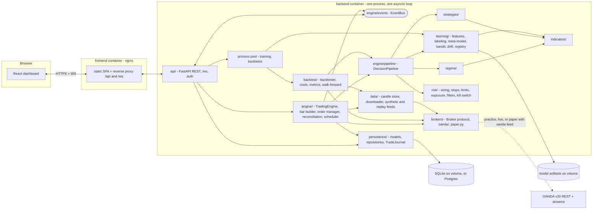
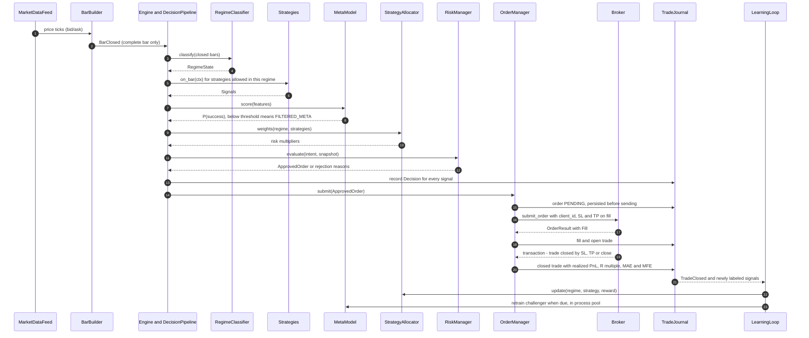
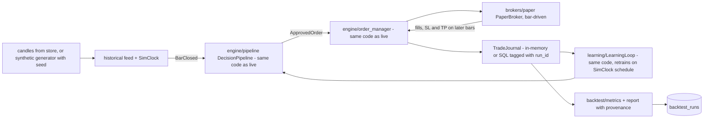

# Altimate FX — Architecture

How the system is put together. `docs/PROJECT_BRIEF.md` wins on conflict; stage scope and
acceptance live in `docs/ROADMAP.md`; decisions are recorded in `docs/adr/`. Interface sketches
below are the contract between agents. Change them here first, then in code.

## 1. Design rules

1. **One decision path.** Regime → strategies → meta-model → allocator → risk is a single pure
   component (`engine/pipeline.py`) used unchanged by the live engine and the backtester.
2. **Broker is the source of truth** for positions, orders and balance; the local DB is a journal
   and a cache that is reconciled against the broker.
3. **Every position has a broker-side stop** attached on fill, so a crashed process leaves
   bounded risk.
4. **Time is injected.** Decision code reads time only from a `Clock` and data only from closed
   bars. Backtests use `SimClock`; live uses `SystemClock`.
5. **Persist, then publish.** Order/trade state is written to the journal before events go out.
6. **Learning can only filter or reallocate risk**, never raise per-trade risk above
   `RiskManager` hard caps.
7. **Secrets** live in env as `SecretStr`, are never logged, returned, or sent to the browser.

## 2. Components



| Package | Responsibility | Stage |
|---|---|---|
| `config.py` | `Settings` (pydantic-settings), mode + interlock validation | 0 |
| `logging.py` | structlog JSON/console logging, secret redaction | 0 |
| `cli.py` | `fxbot` entry point: validate settings, configure logging, serve API (one worker) | 0 |
| `domain/` | Value types, enums, errors, `Clock` | 1 |
| `brokers/` | `Broker` + `MarketDataFeed` protocols, OANDA adapter/streams, `PaperBroker`, factory | 1 |
| `data/` | Candle store, downloader, synthetic generator, replay feed | 1 |
| `indicators/` | Causal vectorized indicators | 2 |
| `regime/` | `RegimeClassifier` | 2 |
| `strategies/` | `Strategy` protocol, trend / mean reversion / breakout, registry | 2 |
| `backtest/` | `Backtester`, cost model, metrics, walk-forward, reports | 2 |
| `risk/` | Sizing, stops, limits, exposure, filters, kill switch, `RiskManager` | 2 (stub), 3 |
| `learning/` | Features, labeling, meta-model, bandit, drift, registry, promotion, `LearningLoop` | 4 |
| `engine/` | `DecisionPipeline` (2), `OrderManager` (2, hardened 5), `TradingEngine`, bar builder, reconciliation, events, scheduler, instance lock (5) | 2, 5 |
| `persistence/` | SQLAlchemy models, repositories, `TradeJournal` (in-memory 2, SQL 5) | 1–5 |
| `api/` | FastAPI app, routers, WebSocket, auth | 5 |

## 3. Data flow

### 3.1 Live / practice / paper trading loop



Steps in words:

1. **Feed.** `OandaFeed` (practice/live, or paper with `FXBOT_DATA_FEED=oanda`), `SyntheticFeed` or
   `ReplayFeed` yields `Price` ticks. In paper mode the engine also forwards ticks to
   `PaperBroker.on_price` so it can fill orders and trigger SL/TP.
2. **Bar builder** aggregates mid prices per instrument/granularity and emits a bar when the first
   tick of the next period arrives or a timer passes the boundary + grace (default 2 s). Periods
   without ticks emit no bar (matches OANDA candles). Bars are stored in `candles`.
3. **Pipeline** (sync, pure, seeded RNG) runs on each closed bar: regime → strategies allowed in
   that regime → features → meta-model score → allocator weight → `OrderIntent` → risk decision.
   It returns one `Decision` per signal, including filtered and rejected ones.
4. **Entry gate.** The engine holds a set of pause reasons (kill switch, loss limit, stale feed,
   reconciliation discrepancy, live start-up). Entries are allowed only when the set is empty;
   exits are always allowed.
5. **Order manager** persists the order, submits with a deterministic `client_id`, and records
   the fill. Exits come from broker-side SL/TP (seen via the transaction stream or polling),
   strategy exits (`should_exit`), the time barrier (`max_hold_bars`), manual close or the kill
   switch.
6. **Journal → learning.** Closed trades and labeled signals feed the allocator and drift
   monitors; the scheduler triggers challenger training; promotion is guardrailed (ADR 0005).

### 3.2 Backtest flow



- Same `Strategy`, `RegimeClassifier`, `RiskManager`, `MetaModel`, `StrategyAllocator`,
  `LearningLoop` and `OrderManager` objects as live; only the clock, feed, broker price source
  and journal backend differ.
- Fill convention: signal on the close of bar `t` fills at the open of `t+1` ± half spread +
  slippage. SL/TP are checked against bar high/low; if both are touched in one bar the stop wins;
  a gap through a stop fills at the open.
- Costs: spread (from candle `spread`), slippage model, commission, financing.
- Walk-forward: models used in fold `k` are trained only on signals whose label horizon ended
  before fold `k` starts (purge + embargo).
- Reproducibility: report stores params, seed, data source and range, cost model, code version,
  config hash. Same inputs → same report hash.
- Parity: `tests/engine/test_parity.py` replays identical bars through `TradingEngine` and
  `Backtester` and requires identical trades.

## 4. Key interfaces

Sketches, not final code. Money/prices are `Decimal`; indicator and learning internals use
`float64`. All datetimes are tz-aware UTC.

```python
from __future__ import annotations

from collections.abc import AsyncIterator, Mapping, Sequence
from dataclasses import dataclass
from datetime import datetime
from decimal import Decimal
from enum import StrEnum
from typing import Protocol

import pandas as pd


# ---- domain/ ---------------------------------------------------------------
class Mode(StrEnum):
    PAPER = "paper"
    PRACTICE = "practice"
    LIVE = "live"


class Side(StrEnum):
    BUY = "buy"
    SELL = "sell"


@dataclass(frozen=True, slots=True)
class Candle:
    instrument: str               # "EUR_USD"
    granularity: Granularity
    time: datetime                # bar open time
    open: Decimal                 # mid prices
    high: Decimal
    low: Decimal
    close: Decimal
    spread: Decimal               # ask - bid at close
    volume: int
    complete: bool


@dataclass(frozen=True, slots=True)
class OrderRequest:
    client_id: str                # idempotency key -> OANDA clientExtensions.id
    instrument: str
    side: Side
    units: Decimal                # > 0, adapter applies the sign
    stop_loss: Decimal            # mandatory, attached on fill
    take_profit: Decimal | None
    price_bound: Decimal | None   # worst acceptable fill price
    strategy_id: str
    signal_id: str

# Also: Instrument, Price(bid, ask, time, tradeable), OrderResult(status, client_id,
# broker_order_id, fill, reject_reason), Fill, Trade, Position, AccountSummary,
# Transaction(id, type, time, payload), TransactionPage(items, last_id).


class Clock(Protocol):
    def now(self) -> datetime: ...


# ---- brokers/base.py -------------------------------------------------------
class MarketDataFeed(Protocol):
    async def get_candles(
        self, instrument: str, granularity: Granularity,
        start: datetime, end: datetime | None = None,
    ) -> list[Candle]: ...        # complete candles only, ascending

    def stream_prices(self, instruments: Sequence[str]) -> AsyncIterator[Price]: ...
    # raises FeedStaleError when no tick/heartbeat arrives within stale_after


class Broker(Protocol):
    name: str
    async def get_account(self) -> AccountSummary: ...
    async def get_instruments(self, names: Sequence[str] | None = None) -> list[Instrument]: ...
    async def get_open_trades(self) -> list[Trade]: ...
    async def get_positions(self) -> list[Position]: ...
    async def submit_order(self, order: OrderRequest) -> OrderResult: ...  # idempotent on client_id
    async def get_order(self, client_id: str) -> OrderResult | None: ...
    async def modify_trade_exits(
        self, broker_trade_id: str, *,
        stop_loss: Decimal | None = None, take_profit: Decimal | None = None,
    ) -> None: ...
    async def close_trade(self, broker_trade_id: str, units: Decimal | None = None) -> Fill: ...
    async def close_all(self) -> list[Fill]: ...
    async def get_transactions_since(self, last_id: str | None) -> TransactionPage: ...


# ---- regime/ ---------------------------------------------------------------
class Regime(StrEnum):
    TRENDING = "trending"
    RANGING = "ranging"
    HIGH_VOLATILITY = "high_volatility"
    UNDEFINED = "undefined"       # warm-up or insufficient data


@dataclass(frozen=True, slots=True)
class RegimeState:
    regime: Regime
    confidence: float
    inputs: Mapping[str, float]   # e.g. adx, efficiency_ratio, vol_percentile


class RegimeClassifier(Protocol):
    version: str
    warmup_bars: int
    def classify(self, bars: pd.DataFrame) -> RegimeState: ...  # last row = last closed bar


# ---- strategies/ -----------------------------------------------------------
@dataclass(frozen=True, slots=True)
class BarContext:
    instrument: Instrument
    granularity: Granularity
    bars: pd.DataFrame            # closed bars only, read-only
    regime: RegimeState
    now: datetime                 # from Clock


@dataclass(frozen=True, slots=True)
class Signal:
    id: str                       # deterministic hash(strategy_id, instrument, bar_time)
    strategy_id: str
    strategy_version: str
    instrument: str
    side: Side
    bar_time: datetime
    entry_ref: Decimal            # close of the signal bar
    stop_distance: Decimal        # proposal; risk/stops clamps it
    take_profit_distance: Decimal | None
    max_hold_bars: int            # time barrier for exits and labels
    rationale: str


class Strategy(Protocol):
    id: str
    version: str                  # bump on any logic or parameter change
    warmup_bars: int
    regimes: frozenset[Regime]    # regimes in which it may open trades
    def on_bar(self, ctx: BarContext) -> Signal | None: ...      # pure
    def should_exit(self, ctx: BarContext, trade: Trade) -> ExitReason | None: ...


# ---- learning/ -------------------------------------------------------------
class FeatureBuilder(Protocol):
    schema_version: str
    def build(self, signal: Signal, ctx: BarContext) -> Mapping[str, float]: ...


class MetaModel(Protocol):
    version: str                  # "passthrough" before min samples
    feature_schema_version: str
    def score(self, features: Mapping[str, float]) -> float: ...  # calibrated P(success)


class StrategyAllocator(Protocol):
    def weights(
        self, regime: Regime, strategy_ids: Sequence[str], *, sample: bool,
    ) -> Mapping[str, float]: ...  # sums to 1, floor/cap applied
    def update(self, regime: Regime, strategy_id: str, reward: float, at: datetime) -> None: ...
    def state(self) -> AllocatorState: ...


# ---- risk/ -----------------------------------------------------------------
@dataclass(frozen=True, slots=True)
class OrderIntent:
    signal: Signal
    regime: Regime
    meta_score: float | None
    risk_multiplier: float        # allocator x meta sizing, clamped to [0, max_multiplier]


class ApprovedOrder:
    """Wraps an OrderRequest. Constructible only inside risk/ (private token)."""
    request: OrderRequest
    risk_amount: Decimal          # account currency at stop


@dataclass(frozen=True, slots=True)
class RiskDecision:
    approved: ApprovedOrder | None
    reasons: tuple[RiskReason, ...]  # code + message; adjustments or rejections


class KillSwitch(Protocol):
    @property
    def engaged(self) -> bool: ...
    async def engage(self, reason: str, actor: str) -> None: ...   # persisted, audited
    async def release(self, actor: str) -> None: ...


class RiskManager(Protocol):
    kill_switch: KillSwitch
    def evaluate(self, intent: OrderIntent, snapshot: RiskSnapshot) -> RiskDecision: ...  # pure
    def on_equity(self, equity: Decimal, at: datetime) -> list[RiskEvent]: ...  # may trip breaker
    def on_trade_closed(self, trade: ClosedTrade) -> list[RiskEvent]: ...
# RiskSnapshot: account, open trades, exposure, day/week P&L, HWM, current spread, now, pauses.


# ---- engine/ ---------------------------------------------------------------
class DecisionPipeline:          # concrete, shared by TradingEngine and Backtester
    def __init__(self, *, regime: RegimeClassifier, strategies: Sequence[Strategy],
                 features: FeatureBuilder, meta_model: MetaModel,
                 allocator: StrategyAllocator, risk: RiskManager, seed: int) -> None: ...
    def on_bar_close(self, instrument: Instrument, bars: pd.DataFrame,
                     snapshot: RiskSnapshot) -> list[Decision]: ...


class OrderManager(Protocol):
    async def submit(self, order: ApprovedOrder) -> OrderRecord: ...  # idempotent
    async def close(self, trade_id: str, reason: ExitReason) -> None: ...
    async def flatten_all(self, reason: ExitReason) -> None: ...      # retries until flat
    async def resolve_unknown(self) -> None: ...


class TradeJournal(Protocol):
    async def record_decision(self, decision: Decision) -> None: ...
    async def record_order(self, order: OrderRecord) -> None: ...
    async def record_fill(self, fill: Fill) -> None: ...
    async def record_trade_closed(self, trade: ClosedTrade) -> None: ...
    async def record_equity(self, snapshot: EquitySnapshot) -> None: ...
    async def record_risk_event(self, event: RiskEvent) -> None: ...
    async def closed_trades(self, *, since: datetime | None = None,
                            strategy_id: str | None = None,
                            mode: Mode | None = None) -> list[ClosedTrade]: ...


class Engine(Protocol):
    mode: Mode
    async def start(self) -> None: ...   # interlock -> lock -> load state -> reconcile -> feed
    async def stop(self) -> None: ...    # no flatten; positions keep broker-side SL/TP
    async def pause_entries(self, reason: str, actor: str) -> None: ...
    async def resume_entries(self, reason: str, actor: str) -> None: ...
    def status(self) -> EngineStatus: ...  # mode, feed health, pauses, last reconcile, lock
```

`Decision` = signal + `RegimeState` + features + meta score/version + allocator weight +
outcome (`ACCEPTED | FILTERED_META | REJECTED_RISK | ENTRIES_PAUSED`) + `RiskDecision`. It is the
audit record behind every row in `signals`.

## 5. Event model

In-process `EventBus` (`engine/events.py`). Events are frozen Pydantic models:
`{type, seq, ts, mode, data}` where `seq` is monotonic per process and `ts` comes from the
`Clock` (sim time in backtests). Each subscriber gets a bounded `asyncio.Queue`; the trading path
never awaits UI subscribers. A slow WebSocket client drops events (counted) and is sent a
`resync` hint to refetch via REST.

| Event | Producer | Persisted in | WS channel |
|---|---|---|---|
| `PriceTick` | feed | — | `prices` (throttled ≤ 4/s per instrument) |
| `BarClosed` | bar builder | `candles` | `prices` |
| `SignalDecided` | engine (pipeline) | `signals` | `signals` |
| `RegimeChanged` | engine | `signals.regime` | `strategies` |
| `OrderSubmitted` / `OrderFilled` / `OrderRejected` / `OrderUnknown` | order manager | `orders` | `orders` |
| `TradeOpened` / `TradeUpdated` / `TradeClosed` | order manager | `trades` | `trades`, `positions` |
| `EquityUpdated` | engine equity task | `equity_snapshots` (periodic) | `account` |
| `RiskEvent` (limit breach, breaker, settings change) | risk manager, API | `risk_events` | `risk` |
| `KillSwitchChanged` / `EntriesPauseChanged` | risk, engine | `settings`, `risk_events` | `risk`, `status` |
| `ReconciliationCompleted` / `ReconciliationDiscrepancy` | reconciler | `risk_events` | `status`, `risk` |
| `AllocationUpdated` | learning loop | `model_versions` (checkpoints) | `learning` |
| `DriftAlert` | learning/drift | `risk_events` | `learning` |
| `ModelRegistered` / `ModelPromoted` / `ModelRolledBack` | registry, promotion | `model_versions`, `risk_events` | `learning` |
| `BacktestProgress` / `BacktestCompleted` | backtest worker | `backtest_runs` | `backtests` |
| `EngineStatusChanged` / `FeedHealthChanged` | engine | — | `status` |

Per-signal risk rejections live on the `signals` row, not in `risk_events`, to keep the event log
about state changes.

## 6. Concurrency model

- **One process, one asyncio loop, one uvicorn worker.** The engine starts in the FastAPI
  lifespan. More workers would mean more engines, so `--workers 1` is mandatory and an instance
  lock (`engine/lock.py`: OS file lock in `FXBOT_DATA_DIR` for SQLite, `pg_advisory_lock` for Postgres)
  stops a second process trading the same account.

| Task | Does |
|---|---|
| `feed` | Reads price stream → bar builder → bounded `bar_queue`; forwards ticks to `PaperBroker` in paper mode |
| `decision` | Consumes `bar_queue` in order → pipeline → order manager. Bars older than one period are journaled and skipped |
| `transactions` | OANDA transaction stream (or `sinceid` polling) / paper transaction log → fills, SL/TP closes |
| `reconcile` | On start, every 60 s *(placeholder)*, and after any `UNKNOWN` order |
| `equity` | Snapshot every 60 s and on every fill; feeds the drawdown breaker |
| `scheduler` | 17:00 New York rollover, labeling sweep, time-barrier exits, retrain checks, candle audit |
| `ws` | One sender per client, fed from its bus queue |

- **Trading lock.** One `asyncio.Lock` serializes order submission, flatten-all and
  reconciliation mutations, so reconciliation never races an in-flight order.
- **CPU-bound work** (model training, backtests, walk-forward) runs in a
  `ProcessPoolExecutor` (1–2 workers). Single-row scoring and small indicator windows run inline.
  Nothing blocking runs on the loop: DB via async SQLAlchemy (aiosqlite), HTTP via httpx with
  explicit timeouts on every call.
- **Shutdown.** Pause entries → cancel tasks → flush journal → release lock. Positions are not
  flattened; their broker-side SL/TP stay active.

## 7. Persistence

SQLAlchemy 2 async; SQLite by default (`FXBOT_DATABASE_URL`, WAL, `busy_timeout`), Postgres-ready.
Money columns `Numeric`, times UTC. `mode` is stored on journal rows so paper, practice and live
histories never mix.

| Table | Key columns | Notes |
|---|---|---|
| `instruments` | `name` PK, base, quote, pip_location, display_precision, trade_units_precision, min_trade_size, margin_rate, enabled | Refreshed from broker on start |
| `candles` | PK (instrument, granularity, time); o, h, l, c (mid), spread, volume, complete, source | `source`: oanda / synthetic / live_built |
| `signals` | `id` PK; bar_time, instrument, granularity, strategy_id, strategy_version, side, regime, regime_inputs JSON, features JSON, feature_schema_version, meta_score, meta_model_version, allocator_weight, outcome, reasons JSON, label, label_r, labeled_at, mode, run_id | One row per `Decision`; labels filled later |
| `orders` | `id` PK; `client_id` UNIQUE, signal_id FK, broker_order_id, instrument, side, units, stop_loss, take_profit, price_bound, status, reject_reason, submitted_at, updated_at, mode | Status: pending → submitted → filled / rejected / cancelled / unknown |
| `trades` | `id` PK; `broker_trade_id` UNIQUE, order_id FK, signal_id FK, strategy_id, instrument, side, units, entry_time, entry_price, stop_loss, take_profit, exit_time, exit_price, exit_reason, realized_pl, financing, commission, r_multiple, mae, mfe, regime_at_entry, origin, status, mode | `origin`: system / external (adopted) |
| `equity_snapshots` | `id` PK; time, balance, nav, unrealized_pl, margin_used, open_trades, hwm, drawdown, mode | |
| `model_versions` | `id` PK; kind (meta_model / allocator), version, status (challenger / champion / retired / rejected), artifact_path, artifact_sha256, feature_schema_version, train_start, train_end, n_samples, params JSON, metrics JSON, parent_version, created_at, promoted_at | Allocator rows are state checkpoints |
| `risk_events` | `id` PK; time, type, severity, actor (system / operator), instrument, signal_id, order_id, details JSON | Audit log: breaches, kill switch, pauses, settings changes, reconciliation, drift, promotions |
| `settings` | `key` PK; value JSON, updated_at, updated_by | Runtime, non-secret, schema-validated keys only (risk params, instruments, strategy toggles, kill-switch state) |
| `backtest_runs` | `id` PK; created_at, status, params JSON, data_source, data_range, seed, code_version, config_hash, metrics JSON, equity_curve JSON, trades JSON or file path, error | Results for the Backtests page |

Allocator state is also recomputable from labeled `signals`, which keeps the journal the single
source for learning. Model artifacts live in `FXBOT_DATA_DIR/models/` and are loaded only if their
SHA-256 matches `model_versions`.

## 8. API surface

REST under `/api`, JSON, Decimals as strings, timestamps ISO 8601 UTC, cursor pagination for
lists. Every route except `/api/health` and `/api/auth/login` requires auth (mechanism per
`docs/SECURITY.md`). No response model contains a secret field.

| Method & path | Purpose |
|---|---|
| `GET /api/health` | Liveness: status, version, mode (no auth, nothing sensitive) |
| `POST /api/auth/login`, `POST /api/auth/logout`, `GET /api/auth/me` | Session |
| `GET /api/status` | Mode, engine/feed/broker health, entry-pause reasons, kill switch, last reconciliation |
| `GET /api/account` | Balance, NAV, margin, unrealized P&L |
| `GET /api/equity?from&to&resolution` | Equity curve |
| `GET /api/positions` | Open positions/trades |
| `POST /api/positions/{trade_id}/close` | Manual close (allowed while kill switch engaged) |
| `GET /api/trades?instrument&strategy&side&outcome&exit_reason&regime&from&to&cursor&limit` | Trade history |
| `GET /api/trades/{id}` | Trade detail with signal, decision, orders, fills |
| `GET /api/signals?...` | Decisions including filtered/rejected |
| `GET /api/candles?instrument&granularity&from&to` | Chart data |
| `GET /api/instruments` | Instrument list and enabled flags |
| `GET /api/strategies` | Per-strategy performance overall and by regime, enabled flag |
| `PATCH /api/strategies/{id}` | Enable/disable |
| `GET /api/regimes` | Current regime per instrument + history |
| `GET /api/allocator` | Current weights per regime × strategy + history |
| `GET /api/learning/models?kind` / `GET /api/learning/models/{version}` | Versions + metrics |
| `POST /api/learning/models/{version}/promote`, `POST /api/learning/rollback`, `POST /api/learning/retrain` | Guardrailed operator actions |
| `GET /api/learning/drift` | Drift alerts and monitor values |
| `GET /api/risk` | Limits, current usage, pauses, kill switch |
| `GET /api/risk/events?type&from&to&cursor` | Audit log |
| `POST /api/risk/kill-switch` `{action: engage \| release, reason}` | Kill switch |
| `POST /api/engine/entries` `{action: pause \| resume, reason}` | Pause/resume entries (also arms live after start-up) |
| `GET /api/backtests`, `POST /api/backtests` (202 + id), `GET /api/backtests/{id}` | Backtests |
| `GET /api/settings`, `PATCH /api/settings` | Non-secret runtime settings; mode read-only; secrets reported only as configured / not configured |

**WebSocket** `/ws`. Authenticated on connect; unauthenticated → close 1008.
Client → server: `{"op": "subscribe" | "unsubscribe", "channels": [...]}`, `{"op": "ping"}`.
Server → client envelope: `{"channel", "type", "seq", "ts", "data"}`.
Channels: `status`, `prices`, `account`, `positions`, `orders`, `trades`, `signals`, `risk`,
`strategies`, `learning`, `backtests`. On subscribe the server sends a snapshot, then deltas.

## 9. Configuration, modes and the live-trading interlock

Settings come from env (and `.env` in development) via pydantic-settings in `fxbot/config.py`,
which is canonical. Every variable uses the `FXBOT_` prefix except `ALLOW_LIVE_TRADING`. The
`Settings` object is frozen; non-secret runtime settings (risk params, instruments, strategy
toggles) are overridden from the `settings` table within hard caps defined in code.

| Setting | Default | Notes |
|---|---|---|
| `FXBOT_TRADING_MODE` | `paper` | `paper` / `practice` / `live`; read at start-up only |
| `ALLOW_LIVE_TRADING` | `false` | No prefix on purpose; env only |
| `FXBOT_LIVE_TRADING_CONFIRMED` | `false` | Second, independent live confirmation |
| `FXBOT_OANDA_ACCOUNT_ID` | unset | `SecretStr`; masked in API and logs |
| `FXBOT_OANDA_API_TOKEN` | unset | `SecretStr` |
| `FXBOT_DATABASE_URL` | `sqlite+aiosqlite:///./data/fxbot.db` (`/app/data/fxbot.db` in the image) | Postgres needs an async driver |
| `FXBOT_API_HOST` / `FXBOT_API_PORT` | `127.0.0.1` / `8000` | Image sets `0.0.0.0` |
| `FXBOT_CORS_ORIGINS` | `http://localhost:5173` | Dev only; production is same-origin |
| `FXBOT_LOG_LEVEL` / `FXBOT_LOG_JSON` | `INFO` / `false` | Image sets JSON |
| `FXBOT_DATA_FEED` *(to add, stage 1)* | `synthetic` | Paper only: `synthetic` / `replay` / `oanda` |
| `FXBOT_DATA_DIR` *(to add, stage 4)* | `./data` (`/app/data` in the image) | Model artifacts, lock file |
| `FXBOT_LIVE_CONFIRM_ACCOUNT_ID` *(proposed, stage 5)* | unset | Must equal `FXBOT_OANDA_ACCOUNT_ID` in `live` |
| Auth secrets | — | Per `docs/SECURITY.md`, `SecretStr` |

| Mode | Broker | Feed | Requires |
|---|---|---|---|
| `paper` | `PaperBroker` | `FXBOT_DATA_FEED` | nothing (`oanda` feed needs practice credentials, read-only use) |
| `practice` | `OandaBroker`, fxpractice host | `OandaFeed` | account ID + token |
| `live` | `OandaBroker`, fxtrade host | `OandaFeed` | account ID + token + `ALLOW_LIVE_TRADING=true` + `FXBOT_LIVE_TRADING_CONFIRMED=true` (+ proposed account-ID match) |

**Interlock** (checked three times, defence in depth; ADR 0004):

1. `Settings` validation refuses `live` unless every gate is set (implemented in the scaffold).
2. `brokers/factory.py` refuses to build a live `OandaBroker` without them and raises
   `LiveTradingNotAllowedError`. Hosts are chosen by mode and cannot be overridden outside tests.
3. `TradingEngine.start()` re-checks and, in `live`, starts with the `live_startup` pause reason
   set (proposed): it reconciles and observes but opens nothing until an operator resumes
   entries.

Mode is never writable through the API. The UI shows the mode on every page.

## 10. Error handling and reconciliation

| Error | Cause | Handling |
|---|---|---|
| `BrokerUnavailableError` | timeout, 5xx, connection reset | GETs retried with backoff + jitter; orders → `UNKNOWN`, resolved by client ID; repeated → pause entries |
| `RateLimitedError` | 429 | Honour `Retry-After`; client-side token bucket |
| `BrokerRejectedError` | 4xx, insufficient margin, market halted | Never retried; order `rejected`; reason journaled |
| `FeedStaleError` | no tick/heartbeat in `stale_after` | Pause entries; reconnect with capped backoff; backfill candles via REST before resuming bars |
| `DataIntegrityError` | out-of-order / duplicate / gap bars | Drop or backfill; journal; never feed a partial bar |
| Pipeline exception | bug or bad data for one instrument | Log + `risk_event`; skip that bar for that instrument; 3 consecutive *(placeholder)* → pause entries |

**Order idempotency.** `client_id = hash(signal_id, attempt)`. On timeout the order goes
`UNKNOWN`; the manager queries the broker by client ID, and `attempt` is incremented only once
the broker confirms the previous attempt does not exist. Never blind-retry a submit.

**Reconciliation** (broker wins), at start before entries are enabled, every 60 s, and after any
`UNKNOWN`:

1. Fetch account, open trades, positions and transactions since the last seen ID.
2. Broker trade unknown locally → adopt as `origin=external`, include in exposure, `WARN` event.
   No stop-loss on it → `CRITICAL` event and entries paused until acknowledged.
3. Local open trade absent at broker → close locally from the broker's closing transaction
   (SL, TP, margin closeout) with broker prices.
4. Field mismatch (units, SL/TP, price) → take broker values, record the diff.
5. Balance differs from journal-derived balance beyond tolerance → `WARN` event.
6. Any unresolved `CRITICAL` discrepancy keeps entries paused.

**Kill switch.** Engage → pause reason set, `flatten_all` via `Broker.close_all`, retried until
reconciliation confirms flat. Release is manual, audited, and does not clear other pause reasons.

**Daily boundaries.** Trading day rolls at 17:00 America/New_York for loss limits and reporting.

## 11. Deployment

```yaml
# docker-compose.yml (shape; the file is finalised in stage 7)
services:
  backend:
    build: ./backend            # python slim + uv, non-root, `fxbot` CLI = one uvicorn worker
    env_file: ./backend/.env    # optional; paper mode needs none
    volumes: [fxbot-data:/app/data]   # SQLite, model artifacts, lock file
    ports: ["127.0.0.1:8000:8000"]    # optional, for direct API access on the host only
    restart: unless-stopped
  frontend:
    build: ./frontend           # node build stage -> nginx serving dist/
    ports: ["127.0.0.1:8080:8080"]
    depends_on: [backend]       # nginx proxies /api and /ws (upgrade) to backend:8000
volumes:
  fxbot-data: {}
```

- The browser talks only to nginx: same-origin `/api` and `/ws`, so production needs no CORS.
  Ports bind to 127.0.0.1; remote access goes through a TLS reverse proxy (`docs/SECURITY.md`).
- Development: `uv run fxbot` (backend) and `npm run dev` (Vite proxies `/api` and `/ws` to
  `BACKEND_URL`, default `http://localhost:8000`).
- CI (`.github/workflows/ci.yml`): backend and frontend jobs run the brief's gates; stage 7 adds
  image builds and a compose smoke test.
- Backups: `sqlite3 /app/data/fxbot.db ".backup ..."` while running (WAL-safe); procedure in
  `docs/RUNBOOK.md` (stage 7).

## 12. Testing seams

- `Broker`, `MarketDataFeed`, `Clock`, `TradeJournal` are injected everywhere; tests use
  `PaperBroker`, `SyntheticFeed`, `SimClock`, `InMemoryTradeJournal`.
- OANDA adapter tests use `respx` with JSON fixtures; a conftest guard fails any real socket.
- Cross-cutting harnesses: lookahead/causality (indicators, regime, strategies, features),
  broker contract suite (paper + OANDA mocked), live/backtest parity, no-wall-clock scan,
  auth-required route scan, secret-leak sentinel.
